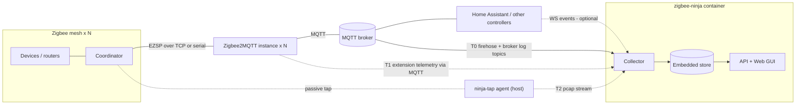
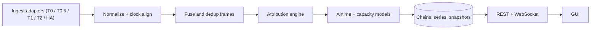

# zigbee-ninja — Architecture & Design

| | |
|---|---|
| **Version** | 0.1 |
| **Date** | 2026-07-14 |
| **License** | Apache-2.0 |
| **Status** | Canonical spec. Code that deviates must update this document in the same change. |

A self-hosted, containerized observability service for Zigbee networks managed by
Zigbee2MQTT: it measures how much of each coordinator's throughput capacity is in
use, attributes that traffic to its causes, and models mesh airtime amplification —
passive by default, permission-gated everywhere else.

> A private appendix describing the author's reference deployment exists outside
> this repository; nothing in this public document depends on it.

## §1 Mission & scope

zigbee-ninja answers one question with defensible numbers: **how much of each
Zigbee coordinator's throughput capacity is being used — and by what?** It runs
continuously, presents everything through its own web GUI, and is built as a
generic, redistributable product: nothing in the core assumes any particular
home's configuration.

Concretely, it must be able to answer:

- **Utilization & headroom** — per coordinator, against an empirically calibrated
  capacity knee, at both steady-state and burst timescales.
- **Attribution** — which share of traffic is controller-commanded (e.g. Home
  Assistant), which is device reporting, which is housekeeping or retry overhead;
  drill down to device, device class, MQTT client, and (with HA integration) the
  individual automation.
- **Latency health** — command queue delay, mesh round-trip, end-to-end
  command→state-echo; correlation of latency/error onset with load.
- **Planning support** — a per-device load ledger sufficient to evaluate moving
  devices between coordinators or consolidating coordinators away (the interactive
  what-if advisor itself is a fast-follow).
- **Pacing validation** — burst-level views fine enough to judge whether command
  staggering/pacing strategies in the controller are earning their keep.

**V1 scope:** Zigbee2MQTT systems (1..N instances on a single MQTT broker),
standalone Docker deployment, three observation tiers (MQTT, Z2M extension,
passive wire tap), calibration, dashboards, alerting.

**Deliberately deferred:** Home Assistant add-on packaging and ZHA support (both
part of the wider-release MVP that follows V1), the what-if rebalancing advisor,
the inline proxy tier for serial adapters, RF sniffing, multi-broker.

## §2 Design principles

| # | Principle | Meaning |
|---|---|---|
| P1 | **Passive by default** | Observation never adds mesh traffic. Active operations — topology pulls, calibration benchmarks — are permission-gated, rate-limited, and individually revocable. |
| P2 | **Consent per foothold** | Every probe deployment is an explicit grant in the GUI, against a named target, revocable later. A footprint page lists everything zigbee-ninja has ever deployed. |
| P3 | **Fail-open** | No V1 probe sits in a required datapath. If zigbee-ninja dies, the mesh never notices. (The future serial-proxy tier is the sole, loudly-labeled exception.) |
| P4 | **Self-accounting** | zigbee-ninja's own MQTT client, topology pulls, and benchmarks are measured and attributed to *itself*, never silently folded into the numbers it reports. |
| P5 | **Confidence-tagged** | Every metric carries a provenance tag — `measured` / `modeled` / `inferred` — surfaced in the GUI, driven by which observation tier produced it. |
| P6 | **Generic core** | All knowledge of the installation comes from discovery and live registries (`bridge/info`, `bridge/devices`, `bridge/groups`). No installation-specific logic in core. |
| P7 | **Single image** | One container: collector, embedded storage, API, and GUI. This is what makes HA add-on packaging a packaging exercise rather than a re-architecture. Multi-arch (amd64/arm64). |
| P8 | **Clean IP** | Apache-2.0; no GPL/AGPL dependencies in distributed artifacts, so the codebase stays commercially forkable (§16). |

## §3 System context

zigbee-ninja sits *beside* the Zigbee stack, never inside it. The broker is the
only mandatory contact point; every other edge is an optional, permission-gated
enrichment.



The V1 deployment target is standalone Docker. The same image later ships as a
Home Assistant add-on, whose constraint — effectively one container, no compose
stacks — is why P7 exists.

## §4 Observation tiers & visibility matrix

Fidelity is tiered. Each tier is independently deployable, and the product
degrades gracefully to whatever the user grants. The GUI presents this as a
per-coordinator **coverage meter**: which tiers are live, and what each missing
tier would add.

### T0 — MQTT firehose *(credentials: broker only)*

Subscribe to each instance's base topic tree plus `$SYS/#`. Sees every command
(`<base>/<target>/set|get`), every state publish, Z2M's bridge log stream
(including BUSY/failure events when enabled), availability transitions, and the
full device/group registries. This tier alone supports message-rate dashboards
and MQTT-level attribution. It cannot see frame sizes, radio timing, retries, or
Z2M-internal radio work.

### T0.5 — Broker publish attribution *(broker-side log reader)*

With debug-level logging enabled, Mosquitto emits per-PUBLISH lines carrying the
**publishing client id** ("Received PUBLISH from `ha-core` …") — turning "a
command arrived" into "client `ha-core` issued this command". The tolerant
parser (`brokerlog.py`) reads those lines.

> **Live correction (2026-07-14, Mosquitto 2.0.22): these debug lines are NOT
> available over MQTT.** `log_dest topic` publishes only notice/subscribe-class
> messages to `$SYS/broker/log/#`; debug-level PUBLISH lines go **only** to
> `stderr`/`file`. So T0.5 cannot be pure-MQTT as originally specified — it
> requires a **broker-side log reader** (tail the journal/file, parse, forward),
> i.e. a foothold on the broker host, not just a config change. On a
> single-controller (HA-only) install the marginal value is also low (nearly
> every command is `ha-core`). **Preferred alternative:** per-*automation*
> attribution via the HA-token integration (§7.4) — broker-safe (read-only HA
> WebSocket) and strictly more informative. Broker debug logging also ~doubles
> broker message volume; measure before enabling.

### T1 — Z2M runtime extension *(credentials: broker only)*

A single-file, dependency-free JS extension deployed *and removed* entirely over
MQTT (`bridge/request/extension/save` / `remove` — confirmed present in Z2M 2.x).
It hooks Z2M's event bus and emits compact batched telemetry: every ZCL frame
in/out at the Z2M boundary with device, cluster, command, sizes, timestamps, and
queue-timing milestones. This is the workhorse tier — it sees Z2M-internal radio
work (availability pings, config readbacks) that never appears on MQTT, and it
works identically for serial and network adapters on any host.

### T2 — Passive wire tap *(host agent, one-liner install)*

For network-attached coordinators, the coordinator↔Z2M link is a long-lived TCP
flow carrying ASH-framed EZSP. A tiny host agent (`ninja-tap`, §7.2) captures
exactly those flows with tcpdump and streams raw pcap to the collector, which
does TCP reassembly and ASH/EZSP decode centrally. This yields exact bytes and
timing for every frame crossing the NCP boundary, per-frame LQI/RSSI on receive,
delivery-status callbacks, and ASH-level link health (retransmits/NAKs on the
wire itself). Because the EmberZNet NCP handles network security, payloads at
this boundary are already decrypted — no network-key handling required.

For serial-USB coordinators there is no passive tap; the equivalent fidelity
requires the **inline proxy** tier (T2b) — a transparent TCP/serial interposer.
It is a product option only, clearly labeled as sitting in the datapath, and is
out of V1 scope.

### T3 — RF sniffer *(reserved, not V1)*

Channel-matched capture hardware would add the only things T2 can't see:
MAC-level retries by remote nodes, CCA busy time, foreign-network and Wi-Fi
contention. The tier is reserved in the data model (a provenance source and
airtime ground-truth input) but not built in V1.

### Visibility matrix

| Signal | T0 | T0.5 | T1 | T2 | T3 |
|---|:-:|:-:|:-:|:-:|:-:|
| Commands & state publishes (MQTT level) | ✓ | ✓ | ✓ | ✓ | — |
| Publishing client identity | ✗ | ✓ | ✗ | ✗ | ✗ |
| Per-frame ZCL detail (device, cluster, command) | ◐ inferred | ◐ | ✓ | ✓ | ✓ |
| Z2M housekeeping traffic (pings, readbacks) | ✗ | ✗ | ✓ | ✓ | ✓ |
| Exact frame bytes → airtime | ✗ | ✗ | ◐ near-exact | ✓ | ✓ |
| Queue latency (enqueue → sent → delivered) | ◐ end-to-end echo only | ◐ | ✓ | ✓ | — |
| Delivery status / APS failure per command | ◐ log stream | ◐ | ✓ | ✓ | ✓ |
| Per-frame LQI/RSSI on receive | ✗ | ✗ | ◐ | ✓ | ✓ |
| NCP-internal stack housekeeping (link status, routing) | ✗ | ✗ | ✗ | ◐ counters/residual | ✓ |
| MAC retries, CCA busy, foreign traffic | ✗ | ✗ | ✗ | ◐ counters | ✓ |

> **Key structural fact:** on EmberZNet NCPs, NWK-layer housekeeping (link status
> beacons, route maintenance) is generated *inside* the coordinator and never
> crosses the EZSP boundary — so even T2 can't see it per-frame. The plan: poll
> EmberZNet's aggregate counters if an access route proves practical (spike S2),
> and treat *counters − attributed frames* as a measured residual for the
> stack-housekeeping bucket; otherwise model it from protocol constants (link
> status ≈ one one-hop broadcast per router per 15 s) with an honest `modeled` tag.

## §5 Discovery & onboarding

Broker-first, not port-scan-first. The only mandatory user input is the broker
address and credentials; nearly everything else falls out of retained topics:

1. **Connect to broker** → subscribe `+/bridge/info`. Every Z2M instance
   announces its base topic, version, network settings (channel, PAN id), and
   adapter configuration — including the adapter URL, which for network
   coordinators (`tcp://ip:port`) hands us the coordinator endpoint T2 needs.
2. **Registries** → `bridge/devices` and `bridge/groups` per instance: IEEE
   addresses, friendly names, vendor/model definitions, Router vs EndDevice,
   power source, exposed capabilities, group membership.
3. **Channel map** → instances sharing a Zigbee channel are flagged: they share
   one airtime pool, and §10 accounts for them jointly.
4. **Controller detection** → presence of the HA discovery prefix (from
   `bridge/info`) suggests HA; the GUI offers the HA integration tile. In add-on
   mode (fast-follow), the Supervisor API provides broker and HA connectivity
   automatically.
5. **Hardware enrichment** → recognized network coordinators (e.g. SMLIGHT SLZB
   series) expose their own HTTP health APIs (uptime, temperature, link state);
   offered as an optional enrichment tile.
6. **Subnet scan** → exists only as an explicit opt-in for exotic setups the
   broker can't reveal. Never default.

Onboarding ends at the **permission plan**: the visibility matrix rendered
against this installation, showing current coverage (T0 by definition) and
precisely what each grantable tile would add.

## §6 Permission tiles & footprint

A **tile** is one grantable capability against one named target:

| Tile | Target | Deploy mechanism | Revoke mechanism |
|---|---|---|---|
| Broker telemetry (T0.5) | broker | Broker debug logging **+ a broker-side log reader** (see §4 T0.5 live correction) — not pure-MQTT on Mosquitto | Remove reader + revert config |
| Z2M extension (T1) | per Z2M instance | `bridge/request/extension/save` over MQTT | `bridge/request/extension/remove` |
| Wire tap (T2) | per capture host | Copy-paste one-liner installer (default); SSH-automated (opt-in) | GUI revoke → agent self-uninstalls; or local `ninja-tap uninstall` |
| Topology pulls | per Z2M instance | Grant + rate limit (networkmap requests load the mesh) | Toggle off |
| Calibration benchmark | per coordinator | Per-run authorization through the wizard (§11) | Abort button; grants never persist across runs |
| HA integration | HA instance | User-pasted long-lived token | Delete token |
| Hardware enrichment | per coordinator device | Enable API polling | Toggle off |
| SSH convenience | per host | User-supplied key, encrypted at rest; used only to automate deploy/remove of other tiles | Delete key |

Tile state machine: `available → granted → deployed → (degraded) → revoked`.
Every deployed artifact is version-stamped and heartbeats to the collector; the
**footprint page** shows each one with health, version drift (probe schema ≠
collector's bundled version → offer redeploy), and one-click removal. A
**revoke-all** control tears down every active probe: extensions removed via
MQTT, agents commanded to self-uninstall, broker config reverted or revert
instructions surfaced.

## §7 Probe designs

### §7.1 Z2M extension — `zigbee-ninja-probe.js`

- **Form:** one dependency-free JS file (Z2M extensions can't `npm install`),
  built and unit-tested in-repo, embedded into the collector image, deployed per
  instance over MQTT.
- **Hooks:** Z2M's extension context (eventBus, mqtt, zigbee, logger, settings —
  per the documented extension API). The exact stable hook inventory across Z2M
  2.x is milestone M3's opening spike (S3); the design assumes at minimum
  message-in/message-out visibility with device identity, which the documented
  events provide.
- **Emits:** batched compact arrays (not verbose JSON) on
  `<base>/zigbee-ninja/probe/{events,stats,heartbeat}`, QoS 0, flushed every 1 s
  or 500 events. Riding the instance's own base topic inherits existing broker
  ACLs.
- **Event record:** monotonic + wall timestamps, direction, target (IEEE/group),
  endpoint, cluster, command, payload *size* (never payload contents by default —
  a toggleable deep-capture mode exists for burst forensics), status/error,
  request-response correlation where Z2M provides it, queue milestones where
  observable.
- **Self-limits:** fixed-size internal buffer, drop-and-count under pressure
  (drops reported in heartbeat — self-accounting extends to the probe itself),
  kill-switch topic, honors `extension/remove`.

### §7.2 Wire-tap agent — `ninja-tap`

- **Philosophy: dumb agent, smart collector.** The agent knows nothing about
  Zigbee. It shells out to `tcpdump` (BSD-licensed system binary) with a BPF
  filter built from the coordinator endpoints discovery found, and streams raw
  filtered pcap to the collector over an outbound, token-authenticated WebSocket.
  All TCP reassembly and protocol decoding happens centrally. A ~200-line
  auditable script is easier to trust, review, and update than a parser fleet.
- **Install:** GUI mints a scoped agent token and renders a one-liner plus the
  raw script for review. Installs a systemd unit with CPU/memory caps and reduced
  privileges (capture capability only). The SSH tile can run the same installer
  remotely for users who opt into convenience.
- **Resilience:** outbound-only connectivity; size-capped local ring buffer when
  the collector is unreachable; explicit drop accounting beyond the cap.
  Uninstall via GUI revoke (self-removal command) or locally.
- **One agent, many flows:** on a hypervisor host bridging several Z2M guests, a
  single agent captures all coordinator flows crossing the bridge.

### §7.3 ASH/EZSP decoder (collector-side)

- TCP stream reassembly (single long-lived flow per coordinator; sequence-based
  dedupe of retransmits) → ASH deframing (escaping, CRC, seq/ack,
  DATA/ACK/NAK/RST) → EZSP frame parse.
- Command coverage is deliberately narrow: the send paths
  (unicast/multicast/broadcast), `messageSentHandler` (delivery status),
  `incomingMessageHandler` (APS frame + per-frame LQI/RSSI), stack status, and
  counter reads if S2 lands. Everything else is length-accounted but not
  deep-parsed.
- EZSP protocol version is read from the version handshake when the capture spans
  a Z2M restart, else inferred from the instance's Z2M version and validated by
  CRC/shape coherence.
- **Clean-room constraint:** ported from zigbee-herdsman (MIT) semantics or
  written from the Silicon Labs UG100 spec — never from bellows/zigpy (GPL, §16).
  Golden pcap fixtures anchor the test suite (spike S1).

### §7.4 HA integration

With a long-lived token, the collector subscribes to HA's WebSocket event stream
(`automation_triggered`, `script_started`, `call_service`). An `mqtt.publish`
service call carries its target topic; its context id (or parent context)
resolves to the automation/script run that fired it, so a chain's commander
becomes *automation X / script Y / UI user Z*.

**This is the primary commander-attribution path** — the broker-safe replacement
for T0.5, which cannot deliver per-PUBLISH client ids over MQTT on Mosquitto
(see §4 T0.5). It is read-only against HA (no writes, no broker change) and
strictly more informative than a client id on a single-controller install.
Implemented in `ingest/hacontrol.py`; the commander it resolves takes precedence
over any broker-log client id in the chain builder. Device area/name enrichment
via the HA registries is a later add-on to the same connection.

## §8 Event pipeline & time model



- **Normalization:** every source adapter emits canonical events (source,
  instance, monotonic + wall timestamps, kind, payload). Probes report their own
  clocks; the collector estimates a per-source offset continuously (EWMA over
  paired observations — the same command seen at broker, extension, and wire
  within milliseconds is a natural alignment signal) and exposes residual skew as
  a data-quality metric.
- **Fusion:** one physical frame may be observed at T1 and T2. Records fuse on
  (instance, direction, address, sequence/APS counter, time proximity) into a
  single FrameRecord carrying per-tier annotations. Disagreement is itself
  signal: T2-only frames quantify what Z2M-level observation misses; T1-only
  frames flag capture gaps.
- **Watermarks:** attribution windows close on a lateness watermark (~2 s). Live
  views show provisional classifications immediately; storage persists finalized
  ones. A small reorder buffer absorbs cross-source jitter.

## §9 Attribution engine

Three orthogonal, joinable dimensions per frame/chain — all derived from generic
sources:

**(1) Causality class.** A command intake (MQTT `/set`|`/get`|bridge request,
with client identity from T0.5) opens a chain: matching TX frames (group targets
expanded via the registry), then response traffic inside an adaptive window
(reads longer, sets shorter; default ≈1.5 s). Classes:

- `commanded` — TX caused by an external MQTT command.
- `provoked` — responses inside a chain window: default responses, read
  responses, post-set report echoes.
- `autonomous` — reports arriving outside any window: sensor telemetry, physical
  actuation.
- `controller-housekeeping` — Z2M's own radio work (availability pings, config
  readbacks, OTA checks), identified directly at T1 or by periodicity patterns.
- `stack-housekeeping` — NCP-internal NWK maintenance: counter-residual if S2
  lands (`measured`), else protocol-constant model (`modeled`).
- `retry-overhead` — APS/MAC retransmission cost, from delivery-status callbacks,
  counters, and the calibrated retry factor.
- `self` — zigbee-ninja's own operations (P4).

**(2) Device & message taxonomy.** Registry join: vendor/model, Router vs
EndDevice, mains vs battery, exposed capability class (light, switch, sensor,
cover, climate, lock…). Message taxonomy: command-set / command-get / report /
action-event / availability / OTA / ZDO; unicast vs groupcast vs broadcast.
"Light set commands vs sensor reporting" falls out of this join on any Z2M
system.

**(3) Commander identity.** MQTT client id (T0.5) with user-assignable labels;
the HA tile upgrades HA-client commands to automation/script/user granularity via
context-id correlation. Non-HA controllers (Node-RED, scripts) attribute at
client granularity automatically.

The default "HA usage" headline = `commanded + provoked` for HA-labeled clients;
every bucket stays independently visible. A **redundant-command detector**
(identical payload to the same target within a configurable window,
cross-referenced by commander) ships as a first-class report — near-duplicate
commands are the cheapest utilization win an automation author can act on.

## §10 Capacity & airtime model

**Per-frame airtime** (802.15.4, 2.4 GHz O-QPSK, 250 kbps → 32 µs/byte):

```text
airtime(frame) = (6 PHY-overhead bytes + PSDU_len) × 32 µs
              + ACK (11 bytes on air ≈ 352 µs, unicast only)
              + IFS (LIFS 640 µs if PSDU > 18 B, else SIFS 192 µs)
              + CSMA backoff expectation (calibrated factor)
```

PSDU length is exact at T2/T3 (`measured`), reconstructed from ZCL payload +
deterministic header/security-overhead arithmetic at T1 (near-exact), and
estimated via a payload→ZCL mapping table at T0 (`inferred`).

**Unicast cost:** `hops × (frame + ACK + IFS) × (1 + retry_rate)`. Hop counts
come from topology snapshots (parent/route data); unknown routes default to a
conservative 1–2 hops, tagged accordingly.

**Groupcast/broadcast cost (mesh amplification):** a group command is a single
coordinator TX, but it rides an NWK broadcast that every router relays — with up
to 3 transmissions each under passive-ack retry rules, and no MAC ACKs. Model:
`(1 + N_routers) × frame_airtime × avg_tx`, with `avg_tx ∈ [1, 3]` (default 1.3,
calibrated per mesh in §11). This is the term that explains why "one more group"
costs far more airtime than coordinator counters suggest.

**Topology snapshots** (router census, parent/route tables, depth estimates)
come from permission-gated, rate-limited networkmap pulls — they load the mesh,
so they're sparse, scheduled, and self-attributed. Between pulls, per-frame
LQI/RSSI at T2 keeps link-quality trends fresh for free.

**Denominators — three, reported side-by-side:**

1. **Channel airtime budget:** 250 kbps × η<sub>CSMA</sub> (default 0.7,
   calibrated). Instances sharing a channel draw from one pooled budget —
   discovery's channel map drives joint accounting. Foreign networks and Wi-Fi
   remain invisible until T3; the GUI says so rather than pretending.
2. **NCP throughput knee:** sustainable frames/s before the latency knee, from
   calibration (§11).
3. **Pipeline service rate:** Z2M's effective command throughput, from T1 queue
   timing.

**Outputs:** utilization percent per denominator; steady headroom (knee − p95
rate) and burst headroom (knee − p99 of 1 s windows); latency SLIs (enqueue→TX,
TX→delivery-confirm, command→state-echo); error SLIs (BUSY, delivery failures) —
plotted against load. That last scatter enables **continuous knee validation**
from natural traffic, catching capacity regressions (firmware updates, mesh
drift) without waiting for a re-benchmark.

## §11 Calibration benchmark

A guided wizard, per coordinator, per-run authorized (grants never persist):

1. **Target selection** — mains-powered routers ranked by suitability (few
   bindings/consumers, healthy LQI); the user picks.
2. **Dry-run preview** — exact traffic to be generated, max rate, duration, abort
   conditions, shown before anything transmits.
3. **Ramp** — closed-loop unicast attribute reads (benign `genBasic`) at stepped
   rates (~20 s per step, geometric ramp), measuring RTT distribution and error
   onset per step. The knee = the step where p95 RTT breaches threshold or the
   error budget spends. An optional, separately-authorized groupcast stage
   against a wizard-created (and wizard-removed) test group calibrates the
   broadcast retry factor.
4. **Safety rails** — hard rate/duration caps; watchdog abort on any error spike
   among *uninvolved* devices or in the bridge log; manual abort always live;
   cool-down pause after the run.
5. **Record** — `{knee_eps, RTT curve, error curve, η estimates, date, Z2M
   version, firmware}`. Benchmark windows are flagged in history and excluded
   from utilization series (they're attributed `self`). Version/firmware changes
   trigger a "recalibrate?" suggestion.

## §12 Storage & data model

Everything embedded, no external services (P7):

- **SQLite (WAL)** — configuration, registries, tiles/footprint, calibrations,
  alert rules/state, finalized chains (48 h detail, aggregates beyond), and
  rollup series.
- **Hourly Parquet segments** — raw event stream for the burst-inspector window
  (~48 h, quota-capped), queried in place by **embedded DuckDB** (MIT) for ad-hoc
  forensics without a series-cardinality explosion.

**Retention tiers:** events + 1 s series ~48 h → 10 s for 2 weeks → 1 min for 90
days → 1 h indefinitely, under a disk quota with a GUI knob; the quota manager
degrades oldest/finest first. **Cardinality budget is explicit:** per-instance
headline series at 1 s; per-device at 10 s+; per-(device × bucket) at 1 min+.
Rough sizing at a busy reference load (~150 events/s aggregate): ~13 M events/day
≈ 1.3 GB/day of Parquet — a 4–8 GB default quota holds the 48 h detail window
comfortably on small hardware.

Core entities: `Instance`, `Device`, `Group`, `Probe/Tile`, `FrameRecord`,
`Chain`, `TopologySnapshot`, `Calibration`, `SeriesPoint`,
`AlertRule/AlertEvent` — each carrying provenance (source tiers) and confidence.

## §13 API & GUI

**Backend:** Python 3.12, FastAPI; REST for configuration/queries, WebSocket for
live streams (1 s fleet counters, burst-inspector tail). **Frontend:** React +
TypeScript + Vite, dark-first but fully dual-theme; uPlot for dense/streaming
time series, d3 for structural views (attribution breakdowns, topology graph).
Static bundle served by the collector. **Auth:** single admin account (argon2)
standalone; HA ingress trust in add-on mode (fast-follow). Default port `8686`.

**V1 views:**

1. **Fleet** — per-coordinator utilization dials (airtime % and knee %), 24 h
   sparklines, active alerts, coverage meters.
2. **Coordinator detail** — stacked series by causality bucket; message-rate,
   airtime, and latency panes; error overlay; shared-channel pooling note.
3. **Attribution explorer** — pivotable bucket × device-class × commander matrix;
   top-N devices/automations; the redundant-command report.
4. **Burst inspector** — event-level timeline over the raw window, zoom to
   milliseconds, chain visualization (command → TX → responses as a micro-gantt).
5. **Topology** — mesh graph from the latest snapshot (LQI-weighted edges,
   relay-load-sized routers), freshness-stamped.
6. **Calibration** — wizard + history + knee-drift indicators.
7. **Footprint & permissions** — tiles, health, versions, revoke-all.
8. **Alerts** — rules and notification center (§14).
9. **Settings** — retention/quota, client labels, tokens.

## §14 Alerting

Threshold rules over any first-class metric (utilization, headroom, latency SLI,
error rate, probe health, data-quality) with sustain windows and hysteresis.
Delivery: the GUI notification center, plus an optional **MQTT discovery
publisher** that exposes headline metrics and alert states as Home Assistant
entities — any HA user gets native notifications/automations for free, tokenless,
and it's the natural bridge for non-HA consumers too.

## §15 Security posture

- **The product never requires host credentials.** Default probe deployment is
  reviewable one-liner installers; agents authenticate with per-agent scoped
  tokens, outbound-only. SSH automation is a strictly optional convenience tile.
- **Secrets** (broker creds, HA token, opt-in SSH key) are encrypted at rest with
  a key held in the data volume (0600). Honest threat model: volume compromise =
  secrets compromise; a passphrase-locked mode is a later hardening step,
  documented as such.
- **Blast radius:** read-only by default (P1); every active operation is
  server-side rate-limited; benchmarks are double-confirmed per run and
  wizard-supervised.
- **Payload privacy:** probes report sizes and metadata, not payload contents,
  unless deep-capture is explicitly toggled for forensics.
- **Probe integrity:** versioned artifacts, schema handshake with the collector,
  drift → redeploy prompt. No telemetry, no phone-home. Image signing (cosign)
  once releases begin.

## §16 Licensing & IP hygiene

- **Apache-2.0**, DCO sign-off on contributions. Inbound-under-Apache
  contribution terms keep the codebase commercially forkable without a CLA.
- **Dependency policy:** no GPL/AGPL code in distributed artifacts. Named
  exclusions: bellows, zigpy, scapy. Named inclusions: zigbee-herdsman as a
  porting *reference* (MIT), dpkt (BSD) if packet-parsing helpers are needed,
  DuckDB (MIT), uPlot (MIT), FastAPI (MIT), tcpdump invoked as an external system
  binary (BSD). A NOTICE file and a CI license check (`tools/license_check.py`)
  enforce the policy.
- **Trademark:** "Zigbee" is a CSA mark; community-tool naming precedent
  (zigbee2mqtt) applies.

## §17 Repository & build

```text
zigbee-ninja/
├── collector/            # Python package
│   ├── zigbee_ninja/
│   │   ├── ingest/        #   T0/T0.5/T1/T2/HA adapters
│   │   ├── decode/        #   TCP reassembly, ASH, EZSP
│   │   ├── attribution/   #   chains, classes, taxonomy joins
│   │   ├── capacity/      #   airtime model, denominators, knees
│   │   ├── calibration/   #   benchmark engine + rails
│   │   ├── store/         #   SQLite + Parquet/DuckDB, retention
│   │   └── api/           #   FastAPI REST + WS
│   └── tests/
├── frontend/              # React + TS + Vite
├── probes/
│   └── z2m-extension/     # single-file JS + test harness
├── agents/
│   └── ninja-tap/         # capture agent + installer
├── deploy/                # Dockerfile, compose.dev, addon/ (fast-follow)
├── docs/                  # this document, probe protocol, decoder notes
└── tests/fixtures/        # golden pcaps, MQTT cassettes (sanitized)
```

CI (GitHub Actions): lint + tests + license check → multi-arch buildx →
`ghcr.io/zirezumi/zigbee-ninja`. The frontend build embeds into the image; one
artifact ships everywhere (P7).

## §18 Milestones

Each milestone ends deployed on a live reference system — continuous dogfooding,
no big-bang integration.

| M | Deliverable | Proves |
|---|---|---|
| M0 | Repo scaffold, CI, container skeleton, config store, auth shell | Ship pipeline works end-to-end |
| M1 | Broker onboarding + discovery + registries; live fleet view (message rates); retention v0 | T0 value on day one, GUI foundation |
| M2 | Attribution v1: chains at T0, taxonomy joins, T0.5 client attribution, redundant-command report, attribution explorer | "Who's doing this" answered at MQTT fidelity |
| M3 | Extension probe + tile/footprint UX + queue latency + self-accounting (spike S3) | Permission model real; Z2M-boundary truth |
| M4 | ninja-tap + reassembly + ASH/EZSP decode + fusion + per-frame LQI/RSSI (spikes S1, S2) | Wire-tier ground truth; fusion quality metrics |
| M5 | Airtime model + topology snapshots + amplification + calibration wizard + utilization/headroom dashboards + continuous knee validation | The headline question answered with calibrated numbers |
| M6 | Alerting + MQTT-discovery entities + hardening/polish → **V1** | Continuous-monitoring posture complete |
| → | Fast-follows: HA add-on packaging, ZHA collector, what-if advisor, T2b proxy, T3 RF tier | Wider-release MVP |

## §19 Risks & spikes

| Risk | Impact | Mitigation / spike |
|---|---|---|
| ASH/EZSP decode effort or version drift | T2 slips | **S1:** capture ~10 min of a live coordinator flow and decode offline *before* M4 commits; golden fixtures pin the suite; port from MIT herdsman |
| EmberZNet counter access route impractical from extension context | Stack-housekeeping stays modeled | **S2:** time-boxed; the modeled fallback is designed-in, not a scramble |
| Z2M extension hook inventory shifts across 2.x releases | T1 fragility | **S3:** enumerate stable hooks; schema handshake; CI matrix against pinned Z2M docker versions |
| Mosquitto debug-log volume/format drift | T0.5 attribution gaps | Verify format + measure overhead early in M2; version-keyed tolerant parser; feature degrades to client-anonymous cleanly |
| Series cardinality on small hardware (Pi add-on audience) | Resource blowups | Explicit cardinality budget (§12), quota-driven degradation, Parquet+DuckDB for detail instead of series explosion |
| Benchmark misbehavior on production meshes | User trust | §11 rails; per-run authorization; supervised first runs |
| Clock skew across probes/hosts | Bad chains/fusion | Continuous offset estimation with skew as a visible health metric; watermarked finalization |
| Shared-channel and foreign-traffic blind spots | Airtime denominator optimistic | Pooled accounting for co-channel instances; honest confidence tags; T3 reserved for ground truth |
